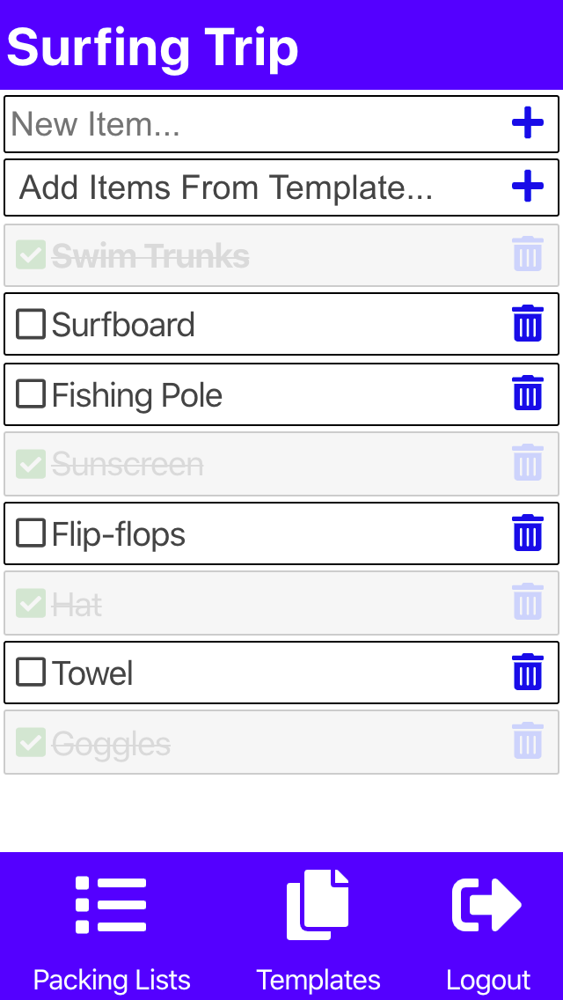
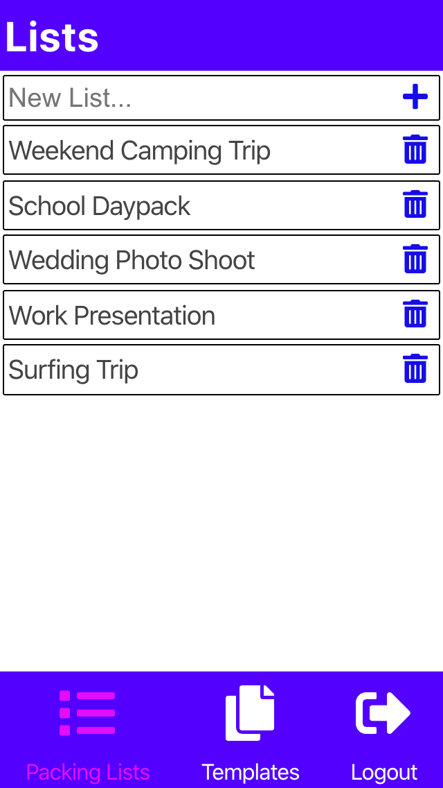
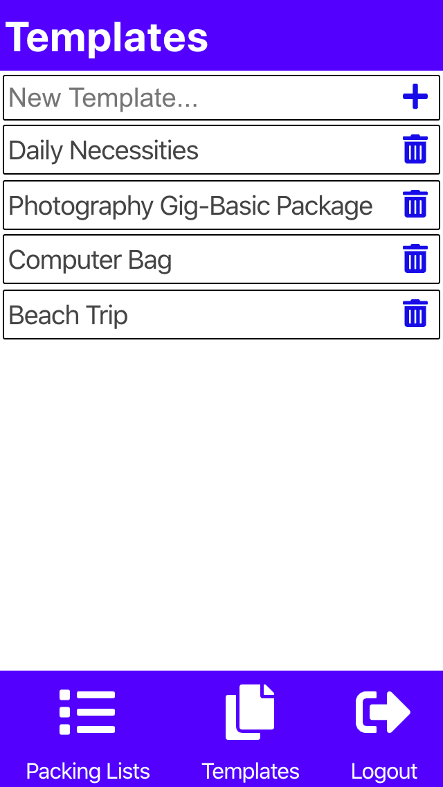

# PAKD Client:
PAKD allows users to make lists of items to pack.
Users can also make templates that can be imported into lists.

## Live Page: [PAKD](https://packed-app.codylee02.now.sh)

## Server:
[PAKD server GitHub](https://github.com/codylee02/packed-api)

## Technology Used
- React
- HTML
- JS
- CSS

## Screenshots:

